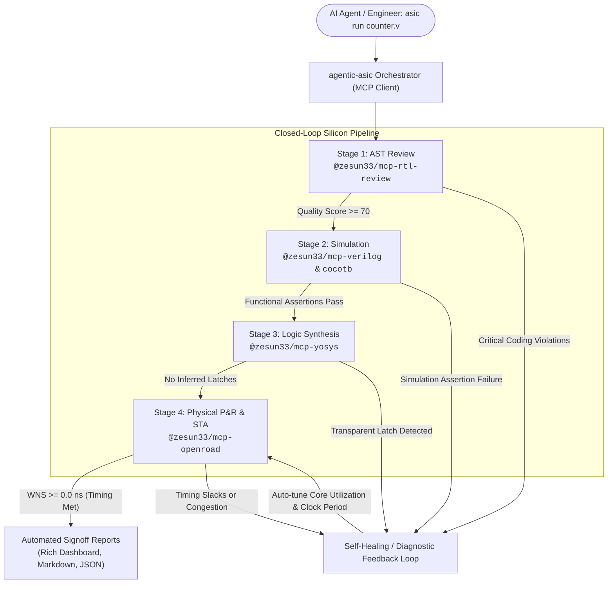

# agentic-asic

[](LICENSE)
[](https://github.com/zesun33/agentic-asic/actions/workflows/ci.yml)
[](pyproject.toml)
[](https://modelcontextprotocol.io)
[](#)

> **Autonomous Silicon Compilation & Signoff Orchestrator powered by EDA MCP Servers.**

`agentic-asic` is a closed-loop silicon compilation and verification engine that acts as a production **Model Context Protocol (MCP) Client**. It coordinates five specialized EDA MCP servers to autonomously take digital RTL designs from Verilog to verified GDSII physical layout with automated static timing analysis (STA) and self-healing parameter optimization.

---

## Architecture & Autonomous Pipeline



---

## The 4 Pipeline Stages

| Stage | EDA Server | Underlying Engines | Purpose & Signoff Gate |
| :--- | :--- | :--- | :--- |
| **1. AST Review** | [`@zesun33/mcp-rtl-review`](https://github.com/zesun33/mcp-rtl-review) | AST Semantic Parser | 0–100 quality score, blocking assignment triage, unclocked register audit. |
| **2. Simulation** | [`@zesun33/mcp-verilog`](https://github.com/zesun33/mcp-verilog) / [`cocotb`](https://github.com/zesun33/mcp-cocotb) | Icarus Verilog + VVP / Cocotb | Behavioral regression testbenches, assertions (`$fatal`), and waveform inspection. |
| **3. Logic Synth** | [`@zesun33/mcp-yosys`](https://github.com/zesun33/mcp-yosys) | Yosys 0.38+ / ABC | Gate technology mapping, transparent latch prevention, cell count profiling. |
| **4. Physical P&R** | [`@zesun33/mcp-openroad`](https://github.com/zesun33/mcp-openroad) | OpenROAD 2.0 (Nangate45 / Sky130) | Floorplanning, global/detailed placement, CTS, routing, and STA timing closure. |

---

## Quick Tour & CLI Usage

### 1. Verify Connected MCP Servers
```bash
asic doctor
```
```text
=== agentic-asic Doctor: MCP Toolchain Verification ===
  agentic-asic version: 0.1.0
  -------------------------------------------------------------
  ✓ review     : .../mcp-rtl-review/dist/index.js
  ✓ verilog    : .../mcp-verilog/dist/index.js
  ✓ cocotb     : .../mcp-cocotb/dist/index.js
  ✓ yosys      : .../mcp-yosys/dist/index.js
  ✓ openroad   : .../mcp-openroad/dist/index.js
  -------------------------------------------------------------
  All 5 EDA MCP servers are operational and resolved.
```

### 2. Run the Deterministic Golden Demo
```bash
asic demo
```
```text
>>> Running agentic-asic Golden Tapeout Flow on fixtures/counter.v <<<

=======================================================================
                      agentic-asic Signoff Dashboard                   
=======================================================================
  Design Module : counter
  Run Timestamp : 2026-09-06 02:35:35 UTC
  Duration      : 2.03 seconds (Self-healing retries: 0)
  ---------------------------------------------------------------------
  Stage              Status       Key Metric / Detail
  ---------------------------------------------------------------------
  1. AST Review      PASSED       Score: 100/100, Violations: 0
  2. Simulation      PASSED       iverilog: 1/1 tests passed
  3. Logic Synth     PASSED       Cells: 10, Inferred Latches: 0
  4. Physical P&R    PASSED       WNS: 0.00ns, Util: 0.35
  ---------------------------------------------------------------------
  ✔ FINAL ASIC SIGNOFF VERDICT: TAPE-OUT READY (ALL GATES PASSED)
=======================================================================
```

### 3. Run Custom RTL Design
```bash
asic run src/alu.v \
  --top alu \
  --tb tests/alu_tb.v \
  --sdc constraints/alu.sdc \
  --period 2.0 \
  --util 0.40 \
  --report-out tapeout_signoff.md
```

### 4. Agent-Friendly JSON Output
```bash
asic run fixtures/counter.v --json
```

---

## Closed-Loop Self-Healing

When physical design faces timing violations (`WNS < 0`) or placement congestion, `agentic-asic` automatically calculates relaxation parameters:
1. **Congestion Relaxation**: Dynamically reduces `core_utilization` (e.g. 0.45 → 0.35) and re-invokes placement.
2. **Timing Slack Relaxation**: Automatically recalculates clock periods based on the Worst Negative Slack (WNS) margin.
3. **LLM Diagnostic Prompting**: Generates actionable, structured prompts formatted with exact source lines and AST diagnostics for autonomous code repair by language models.

---

## 6-Gate Engineering Verification Suite

`agentic-asic` strictly adheres to the multi-gate engineering standard defined in [`hw-agent-tooling`](https://github.com/zesun33/hw-agent-tooling):

```bash
# Full verification (with live multi-stage container pipeline)
./scripts/verify.sh

# Fast / CI verification (headless environments)
./scripts/verify.sh --quick
```
- **Gate 1**: Spec Lock & Package Integrity (`pyproject.toml`, `README.md`, `LICENSE`, `CHANGELOG.md`)
- **Gate 2**: Static Quality & Syntax Check (`py_compile`)
- **Gate 3**: Unit Tests (MCP framing, parameter relaxation, diagnostic generators)
- **Gate 4**: Integration Fixture Suite (Full flow on `counter.v` and negative detection on `counter_bad.v`)
- **Gate 5**: Packaging & CLI Executable (`bin/asic --help`, `bin/asic doctor`)
- **Gate 6**: Golden Transcript & Signoff Schema Contract (`signoff_report.json` validation)

---

## Author & Research Background

Developed by **Md Zesun Ahmed Mia** ([@zesun33](https://github.com/zesun33) | [zesun33.github.io](https://zesun33.github.io)):
- **PhD Candidate in Electrical Engineering**, Penn State University ([NeuroAI Lab](https://sites.psu.edu/sengupta/)).
- **Ex-Micron Technology ML Intern**, Pathfinding and Strategy Group (Compute-in-Memory NVM architectures, LLM inference acceleration, PD disaggregation).
- **Ex-Intel Corporation Graduate Intern**, Thin films, material characterization, AI predictive modeling of process variation.

## License

Licensed under the [Apache License, Version 2.0](LICENSE).
